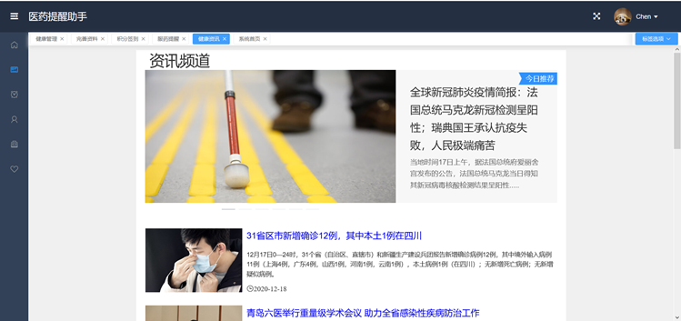
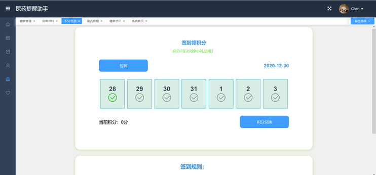

# 长安健康管理系统

> 该系统为数据库课程大作业，本次系统搭建中我主要负责前端系统的搭建处理。
>
> 前端通过 vue、vue-router、highcharts、echarts、axios 等技术栈完成了一个比较完善的健康管理系统。

帮助人们特别是老年人以及工作忙的年轻人吃好药、按时吃药。同时让用户对自己的身体健康管理有一个清晰的了解。

**后端请参考：**[长安健康管理系统后端](https://github.com/Harder-Better-Faster-Stronger/MedicalSystem)

## 应用背景

当人们的生活愈加富足之后，人们对健康也越来越重视，然而现代生活节奏十分迅速，很多人对于自己的健康管理是有心无力，于是我们决定开发一个系统来辅助人们管理自身和家人的健康。

长安健康管理系统主要解决的问题有两个：一个是人们的用药管理，让人们能够定时合理的用药；一个是身体信息管理，记录人们的各项身体指标，让人们对自身健康情况有个清晰的了解。

## 系统功能设计

### 用户管理：

实现用户的登录和注册等功能，通过账号管理个人信息。

### 用药管理：

能够添加用药提醒，到规定时间会有相应的用药提示，能够显示与当前用药所冲突的物品。

### 身体信息记录：

能够记录身体的血糖血脂等信息，并能根据信息生成多种样式的表格，使信息更加直观。

### 健康资讯：

显示当前最新的与身体健康有关的文章，拓展人们关于健康管理的知识。

### 其它：

签到领奖、信息完善等。

## 数据库设计

## 后端架构设计

### 系统分层

* 实体层(Entity)：定义实体类；
* 持久层(Dao)：为Service层提供接口，实现对数据库的操作；
* 业务层(Service)：处理基本的业务逻辑；
* 控制层(Controller)：实现与前端的信息交互；

### 技术栈

* 数据访问层：Mybatis、MySQL、JDBC
* 业务逻辑层：SpringBoot
* 界面表现层：vue、axios、element-ui、echarts、highcharts
* 项目管理工具：Git

## 前端页面展示

**登录**

**首页**

**健康资讯**

**服药提醒**

**信息补充完善**

**签到领取积分抽奖**

**健康报告**

## 作者

### iStitches